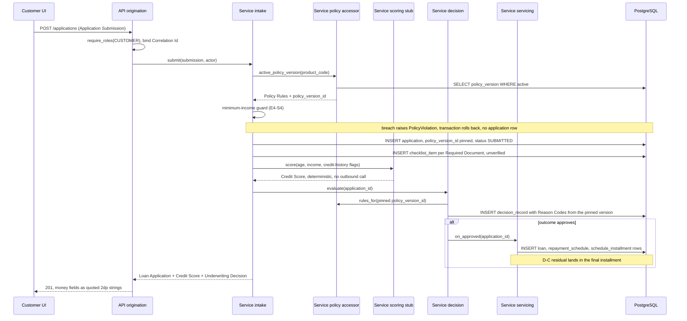
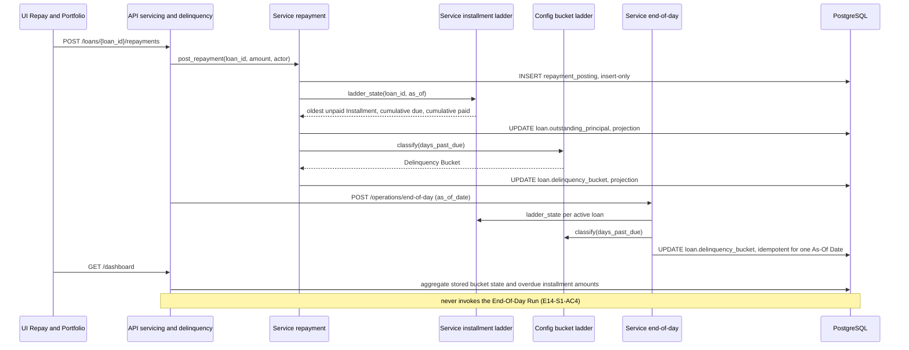

# Architecture — TrueLend

Configurable loan origination, disbursement and repayment for Horizon Bank.
Scope is M1-M3 in one graph: 29 ready stories, 17 epics, 6 ownership clusters.

Authority for everything below is `specs/decisions/design-decisions.json`. This
document decides nothing; where a story or the FRD implies something a recorded
decision forecloses, the decision wins and the conflict is named in
**Precedence conflicts** rather than quietly reconciled.

---

## Recorded decisions

| id | Decision | Rules out |
|---|---|---|
| **D-A** | A `policy_version` row holds its Policy Rules as a JSONB threshold document validated by a Pydantic model; one threshold-driven evaluator reads it. A new Loan Product is an INSERT, no deploy. | No per-product code branches, no product-specific strategy classes, no expression DSL / parser / eval sandbox. A new threshold *kind* stays a schema change. No ALTER TABLE per threshold. |
| **D-B** | Days Past Due counts from the oldest unpaid Installment due date to the As-Of Date. CURRENT 0-29, DPD-30 30-59, DPD-60 60-89, DPD-90 90-179, NPA 180+. Boundaries are Config-layer constants. | NPA at 90 days. Per-product configurable ageing, so the End-Of-Day Run never resolves a Policy Version. DPD measured from disbursement or from the latest missed installment. |
| **D-C** | Every Installment carries the 2dp rounded EMI except the last, which absorbs the accumulated Rounding Residual so the Repayment Schedule sums exactly to Total Payable. FR-07 is exact equality, no epsilon. | Any epsilon or tolerance in the FR-07 test. Storing unrounded money and rounding at the edge. Distributing cents across early installments. |
| **D-D** | A Loan Application stores `policy_version_id` at creation. Checklist, Credit Score evaluation, Underwriting Decision and any Override read that pinned row. An activation never retargets an in-flight application. | Reading the Active Policy Version anywhere in the decision path. Pinning at decision time. A decision not reproducible from stored data. Retroactive re-decisioning. |
| **D-E** | Insert-only: `policy_version`, `repayment_schedule`, `schedule_installment`, `decision_record`, `repayment_posting`, `disbursement`, `audit_event`. Mutable projections: `application.status`, `loan.outstanding_principal`, `loan.delinquency_bucket`. | Any update or delete method on the insert-only repositories — an architecture test, not a convention. Overwriting a decision on Override. Full event sourcing. |
| **D-F** | Login returns a signed JWT carrying `sub`, `role`, `exp`. One `require_roles(...)` FastAPI dependency guards every non-public router — one enforcement point at the API layer. | Per-route hand-written role checks. Authorization in the Service layer. A session store or Redis service in the Compose stack, and the CSRF surface a cookie would add. No refresh token in v1. |
| **D-G** | `NUMERIC(14,2)` in Postgres, `Decimal` in Python, a **quoted 2dp string** in JSON via a Pydantic serializer, parsed with a decimal library in TypeScript. No float touches a monetary value at any hop. | Float and JSON numbers for money across all six layers. **Integer minor units** and their scale/unscale conversions. Native-number arithmetic on money in the frontend. The wire contract is a string, so changing it to a number is a breaking API change. |
| **D-H** | Every `$defs` key in `data-models.schema.json` and every `components.schemas` key in `api-contracts.schema.json` is a term in `specs/design/CONTEXT.md`. A new name goes in CONTEXT.md first. | DTO-suffixed schema names such as ApplicationCreateRequest or DecisionResponse. Request bodies compose by reference against the domain schema. |
| **D-I** | The five bounded contexts (policy, origination, servicing, delinquency, identity) each get a module inside the Repository, Service and API layers, so ownership splits by context as well as by layer. | A single flat service or repository package every story edits. Cross-context reads through another context's repository — they go through its service. |
| **D-J** | `E9-S1-AC3` and FRD-57 are amended to "held as a decimal value, never a float". D-G stands: frontend money wraps a decimal library over the quoted 2dp wire string. | Integer minor units anywhere in the frontend, including a scale/unscale helper at the browser edge. Reading `E9-S1-AC3` literally as a representation assertion — the amended AC is the only oracle for `E9-S1`. |
| **D-K** | Within the oldest unpaid Installment a partial Repayment applies to **interest first, then principal**. FIFO across whole Installments is unchanged; `applied_principal + applied_interest = amount` stays a CHECK constraint. | Pro-rata splitting by the Installment's stored components. Refusing a non-whole-installment payment with a 422 — underpayments are accepted. Reducing outstanding principal by the full payment amount. |
| **D-L** | `MANUAL_REVIEW` is added to the Application Status term in `CONTEXT.md` and to the `ApplicationStatus` enum, which moves from six states to seven. The workbench filter is a plain status filter. | The documented query-filter alias, and the divergence between the two staff mockups and the schema. Rewording `E6-S2-AC1` or `E7-S1`. |
| **D-M** | `Settings.jwt_ttl_seconds = 3600` (60 minutes). With no refresh token per D-F, that is the whole session length. | An 8-hour working-day token and its theft window. A 30-minute TTL that forces mid-shift re-login. A refresh token to compensate, which D-F already forecloses for v1. |
| **D-N** | `ADMIN` for both Loan disbursement (FRD-8) and the End-Of-Day Run (FRD-14). Both routes carry `require_roles(ADMIN)`. | `UNDERWRITER` disbursement — approving an application and moving the money stay separate privileges. A second shape in the `require_roles` matrix for privileged money-adjacent operations. |
| **D-O** | No rate limit, quota or throttle in v1. `api-contracts.md` states none per endpoint, including `POST /auth/login`. | Throttling middleware in the app factory and any per-endpoint quota, so no test asserts one. Login has no attempt throttle — a credential-stuffing gap accepted, not overlooked. |

D-A through D-G and D-J through D-O are load-bearing; D-H and D-I were accepted
defaults. D-J through D-O were recorded in a second round, each resolving one
item this rendering had returned as unresolved; `design-unresolved.json` is now
empty.

## Precedence conflicts — decision wins, stated not reconciled

1. **Frontend money representation — settled by D-J.** FRD-57 and `E9-S1-AC3`
   originally required the frontend to hold money as **integer minor units**,
   which D-G rules out. **D-J amends both** to "held as a decimal value, never a
   float" and leaves D-G standing: `frontend/src/types/money.ts` wraps a decimal
   library over the quoted 2dp wire string and never converts to minor units.
   The amended AC is the **only** oracle for `E9-S1` — D-J rules out reading the
   old wording as a representation assertion, so no implementer may add a
   minor-unit conversion to satisfy it, including a scale/unscale helper at the
   browser edge. `E9-S1`'s acceptance criterion, `features.json` entry (F011) and story
   bundle carry the amended wording as of the D-J round, so no contradictory
   oracle remains; FRD-57 is amended in the extracted BRD spine only, not in
   `specs/brd/source-frd.md`.
2. **Reason codes and the "active" version.** FRD-4 says reason codes are
   referenced from the *active* policy version. D-D pins at submission and forbids
   reading the Active Policy Version in the decision path. Rendered per **D-D**;
   `E5-S2-AC2` and `E5-S2-AC4` already state the pinned reading, so the FRD
   wording is the loose one.
3. **Insert-only table names.** D-E names the append-only *set* (installment,
   decision, repayment, audit entry); the story ACs name the physical tables the
   architecture tests scan for (`schedule_installment`, `decision_record`,
   `repayment_posting`, `audit_event`). Physical names follow the ACs, the set
   follows D-E. The mapping is in `data-models.md`.
4. **MANUAL_REVIEW is a status as well as an outcome — settled by D-L.**
   `E6-S2-AC1` and `E7-S1` speak of applications "in SUBMITTED or MANUAL_REVIEW
   state". CONTEXT.md originally enumerated six Application Statuses, with
   `MANUAL_REVIEW` appearing only as a Decision Outcome. **D-L adds
   `MANUAL_REVIEW` to the Application Status term in CONTEXT.md and to the
   `ApplicationStatus` enum**, which moves from six states to seven: an
   application whose latest Underwriting Decision outcome is `MANUAL_REVIEW`
   carries `MANUAL_REVIEW` as its status. The workbench filter is therefore a
   plain status filter, not an alias. D-L rules out the documented query-filter
   alias and rules out rewording `E6-S2-AC1` or `E7-S1`; the two staff mockups
   already label it a status and need no change. Per D-H's ordering the
   CONTEXT.md edit lands before the schema change, and it has.
5. **Layer directory names.** `backend/CLAUDE.md` says `src/services/`; the layer
   gate and `E15-S2-AC2` enumerate the six layers as types, config, repository,
   service, api, ui. Rendered **singular** (`backend/src/service/`) so the one-way
   dependency test resolves paths.

## Forced consequences — not new decisions

- **Paid/unpaid Installment state is derived, never stored.** D-E lists no
  installment paid flag among the mutable projections and `schedule_installment`
  is insert-only, so "oldest unpaid Installment" — which D-B's DPD definition
  requires — is computed by comparing the cumulative EMI ladder against total
  posted Repayments for the Loan. One function owns that comparison and both the
  Repayment path and the End-Of-Day Run call it; two independent derivations
  would let DPD and allocation disagree.
- **Repayment allocation is FIFO by Installment**, for the same reason: that
  derivation *is* the allocation. Within the oldest unpaid Installment a partial
  Repayment applies to **interest first, then principal** (**D-K**), which rules
  out pro-rata splitting by that Installment's stored components and rules out
  refusing a non-whole-installment payment with a 422 — the API keeps accepting
  underpayments. Outstanding principal falls by `applied_principal` only, never
  by the full payment amount; that arithmetic error is exactly what
  `E11-S2-AC1` exists to catch.
- **No file-upload surface exists in M1-M3.** No AC uploads a document.
  `E4-S2-AC4` creates checklist rows carrying a document type and an unverified
  status, and `E6-S1` actions those rows. The Application Document *is* the
  checklist row.

## Rendering-level instantiations — libraries, not decisions

Committed stack: Python 3.12 / FastAPI / uv, TypeScript 5.x / React + Vite / npm,
one PostgreSQL database, Docker Compose self-hosted. Concrete packages chosen at
rendering because the decisions file fixes the stack but not the library:
SQLAlchemy 2.x + Alembic (an ORM is implied by `E3-S1-AC2`'s "0 ORM mutations",
and `migrations/` by `E3-S1-AC3`), PyJWT for D-F, `passlib[bcrypt]` for credential
hashing, `decimal.js` for D-G's decimal library, `axe-core` for `E17-S1`, and an
in-process httpx + asyncio driver for `E15-S3`, which forbids an external load
service. Money intermediates use Python's default decimal context of 28
significant digits; only stored and wire values are quantized to 2dp.

---

## Bounded contexts — Step 0.7 modularity assessment

| Context | Class | Volatility | Owns | Published contract |
|---|---|---|---|---|
| **Policy & Catalog** | core | high | Loan Product, Policy Version, Policy Rules, Threshold, Reason Code, Required Document | Read-only accessor returning validated Policy Rules for a pinned `policy_version_id`, plus that version's Reason Code set. Activation is a write on this context alone. |
| **Origination** | core | medium | Applicant, Loan Application, Application Document, Document Checklist, Underwriting Decision, Override, Credit Score Stub | Submit an Application Submission; verify an Application Document; evaluate or override an Underwriting Decision. Emits an approved application for Servicing. |
| **Servicing** | core | low | Loan, Disbursement, Funding Source, Repayment Schedule, Installment, Repayment, Outstanding Principal | Disburse an approved application; read a Repayment Schedule; post a Repayment. Publishes the Installment ladder Delinquency reads. |
| **Delinquency & Portfolio** | core | medium | Days Past Due, Delinquency Bucket, As-Of Date, End-Of-Day Run, Portfolio Summary | Recalculate buckets for an As-Of Date, idempotently; read a Portfolio Summary. Consumes the published ladder, never Servicing's tables. |
| **Identity & Audit** | supporting | low | User, Role, Audit Entry, Correlation Id | `require_roles(...)` at the API layer; append an Audit Entry; bind a Correlation Id per request. |

**Balanced coupling.** Policy & Catalog is the configurability surface and
therefore the most volatile, so its distance from consumers stays high: a narrow
versioned accessor, never a shared model, and nobody reads the JSONB document
directly. Servicing to Delinquency is genuinely sequential at low and medium
volatility, so the stronger integration — Delinquency reading the published
Installment ladder — is acceptable. Identity & Audit is low-volatility and
generic, so direct use by every context leaks almost no knowledge, which is
exactly why it must stay free of domain meaning and record actor, action and
entity id as opaque values.

**Coupling risks, each carried into the Canvas Safeguards section.**

| Risk | Safeguard |
|---|---|
| Shared mutable money model — one Money type as both column and wire type invites float leakage | D-G representation at every hop; the Pydantic serializer exists in exactly one module |
| Duplicated rule: DPD boundaries re-derived by the End-Of-Day Run, the post-Repayment recalculation and the Portfolio Summary | one Config-layer mapping function, asserted by an architecture test (`E16-S1-AC1`) |
| Duplicated rule: the EMI and residual formula | one module, referenced by schedule generation and by the FR-07 invariant test |
| Cross-context import — Delinquency reading Servicing repositories, or Origination reading the policy JSONB | bounded-context roots declared in `project-manifest.json`, enforced with the layer test |
| Projection drift — `loan.outstanding_principal` and `loan.delinquency_bucket` diverging from the facts | replay reconciliation against `repayment_posting` and `disbursement` |
| Pass-through modules — six layers invite Service classes that only forward | where a story has no business rule the router uses the repository contract directly; no empty pass-through is written |
| Argument clumps — `(principal, rate, tenure)` and `(as_of_date, loan_id, bucket)` travel together | value objects in Types before the clump spreads |

**Carried over from `/spec`.** U3: cluster C1 is 21 stories and 103 points and is
biconnected, accepted as single-owner at the `/spec` gate and sequenced by the 13
waves; D-I supplies the per-context file ownership that lets implementation
parallelize anyway. U4: the `E11-S1 -> E12-S1` contract edge is not a cluster
cut; C2 is owned as one 8-point cluster and no parallelism is claimed for it.

---

## Components

```
UI      React + Vite screens ............ Apply, Track, Repay, Workbench, Admin console, Policy Editor, Portfolio
API     FastAPI routers per context ..... require_roles, correlation-id middleware, error mapping, money serializer
Service Business rules per context ...... policy accessor, intake, scoring stub, decision evaluator, schedule
                                          generation, disbursement, repayment posting, end-of-day, portfolio
Repo    SQLAlchemy repositories .......... insert-only for the D-E set, projection writers for the three mutables
Config  constants and settings ........... DPD boundaries, decimal context, logging, JWT settings, database URL
Types   domain types and typed errors .... Money, PolicyRules, DelinquencyBucket, DecisionOutcome, PolicyViolation
```

No module in this design exists only to forward a call. Where a story has no rule
of its own — the catalog read, the audit-entry read — the router uses the
repository contract directly.

## Data flow — submit, score, decide, schedule



## Data flow — repayment, ageing, portfolio



## Cross-cutting

- **Correlation Id** — middleware honours an inbound `X-Request-ID` or generates
  one, binds it for the request scope and echoes it on the response; every log
  line carries `request_id` (`E15-S1-AC3`, `E15-S1-AC4`).
- **Redaction** — a filter installed on every configured logger drops PAN,
  Aadhaar and salary-document content; a test enumerates loggers and fails on one
  registered without it (`E15-S1-AC2`).
- **Authorization** — `require_roles(...)` only, at the router. A generated suite
  enumerates underwriter and admin routes from the OpenAPI schema and asserts
  100% coverage of the 401 and 403 cases (`E1-S2-AC3`).
- **Audit** — every underwriter and admin action appends one `audit_event`
  carrying actor, action, entity id and timestamp, plus comment and reason code
  for an Override.
- **Errors** — typed errors in Types, mapped once at the API boundary.
  `PolicyViolation` surfaces as `PolicyViolationException` naming the breached
  threshold and the configured value it was checked against (`E4-S4-AC2`).
- **Observability** — `GET /health` (`E15-S1-AC5`) and `GET /metrics`, the latter's
  path taken from `project-manifest.json` under `observability.metrics_path` and
  not from any story. Runtime SLO: p95 under 500 ms, error rate under 1%
  (`E15-S3-AC1`).

## Manifest change this design requires

The layer gate defaults to `layer_roots: ["src"]`, which finds nothing under
`backend/src` — so without the block below `E15-S2-AC2` passes vacuously and the
gate warns instead of checking. **This block was written into
`project-manifest.json` at the design gate** rather than deferred, so the gate is
live before any source exists. `E15-S2` still owns the file and must keep the
block in step with the layout it builds.

```json
"architecture": {
  "layers": ["types", "config", "repository", "service", "api", "ui"],
  "layer_roots": ["backend/src", "frontend/src"],
  "contexts": {
    "roots": ["backend/src/repository/policy", "backend/src/repository/origination",
              "backend/src/repository/servicing", "backend/src/repository/delinquency",
              "backend/src/repository/identity", "backend/src/service/policy",
              "backend/src/service/origination", "backend/src/service/servicing",
              "backend/src/service/delinquency", "backend/src/service/identity"],
    "public": ["__init__"]
  }
}
```
