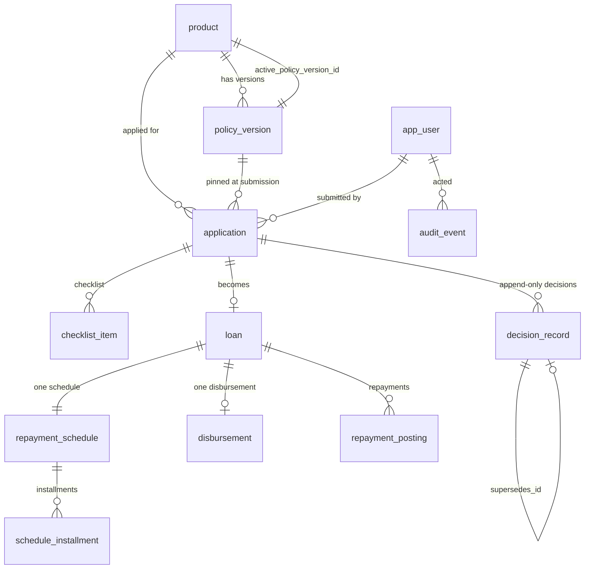

# Data models

One PostgreSQL database. Money is `NUMERIC(14,2)` everywhere (D-G); no monetary
column is `float`, `double precision` or an integer minor-unit count. Rates are
`NUMERIC(9,6)` annual nominal percent — a representation choice forced by the
same fixed-point discipline, **not** a business bound.

The machine-readable form is `data-models.schema.json` (JSON Schema 2020-12);
`$defs` keys are CONTEXT.md terms (D-H).

## Insert-only versus mutable

D-E draws the line. The decision names the append-only *set*; the story ACs name
the physical tables the architecture tests scan for, so the physical names below
follow the ACs.

| D-E name | Physical table | Write modes allowed |
|---|---|---|
| policy_version | `policy_version` | INSERT only |
| repayment_schedule | `repayment_schedule` | INSERT only |
| installment | `schedule_installment` | INSERT only |
| decision | `decision_record` | INSERT only |
| repayment | `repayment_posting` | INSERT only |
| disbursement | `disbursement` | INSERT only |
| audit_entry | `audit_event` | INSERT only |

Mutable projections, and **only** these: `application.status`,
`application.credit_score`, `loan.outstanding_principal`,
`loan.delinquency_bucket`, `loan.days_past_due`, `loan.status`,
`checklist_item.status` (+ its `rejection_reason`, `actioned_by`, `actioned_at`),
and `product.active_policy_version_id`.

Two forced consequences:

- **Activation is a pointer on `product`, not a flag on `policy_version`.**
  Flipping an `is_active` column on `policy_version` would be an UPDATE against a
  table `E3-S1-AC2` scans for zero UPDATE statements. So `product` carries
  `active_policy_version_id` and `PolicyVersion.is_active` on the wire is computed
  as `product.active_policy_version_id = policy_version.id`.
- **No installment paid flag exists.** `schedule_installment` is insert-only and
  D-E grants no such projection, so paid/unpaid is derived by comparing the
  cumulative EMI ladder with the sum of `repayment_posting.amount` for the loan.
  One function owns that derivation (`service/servicing/installment_ladder.py`).

There is also **no `end_of_day_run` table.** `E12-S1-AC2` requires every stored
row to be byte-identical after a second run for the same As-Of Date, so the run
persists nothing of its own: it writes only the `loan` projections it recomputes
and appends one `audit_event` recording the invocation. `EndOfDayRun` is a
response value object, marked derived in the schema.

---

## Entities

### product — Loan Product

| Column | Type | Constraints |
|---|---|---|
| `product_code` | `TEXT` | PK, one of `PERSONAL`, `VEHICLE`, `EDUCATION` |
| `name` | `TEXT` | NOT NULL |
| `active_policy_version_id` | `UUID` | FK → `policy_version.id`, NOT NULL after seeding, UNIQUE |

`UNIQUE(active_policy_version_id)` is what makes `E2-S1-AC2` structural: no two
products can reference the same Policy Version. Carries no threshold column —
D-A rules out ALTER TABLE per threshold.

### policy_version — Policy Version / Policy Rules

| Column | Type | Constraints |
|---|---|---|
| `id` | `UUID` | PK |
| `product_code` | `TEXT` | FK → `product.product_code`, NOT NULL |
| `version_number` | `INTEGER` | NOT NULL, `UNIQUE(product_code, version_number)` |
| `rules` | `JSONB` | NOT NULL, validated by the `PolicyRules` Pydantic model on write (D-A) |
| `created_by` | `UUID` | FK → `app_user.id` |
| `created_at` | `TIMESTAMPTZ` | NOT NULL |

Insert-only. Indexes: `(product_code, version_number DESC)`.
`rules` holds min_income, min_age, max_age, min_credit_score, min_tenure_months,
max_tenure_months, annual_rate_pct, reason_codes[], required_documents[]. A new
threshold *kind* is a change to the Pydantic model and therefore code — D-A
accepts that; retuning a value and launching a product are not.

Example:
```json
{ "id": "5f2b...", "product_code": "PERSONAL", "version_number": 3,
  "rules": { "min_income": "25000.00", "min_age": 21, "max_age": 60,
             "min_credit_score": 650, "min_tenure_months": 6, "max_tenure_months": 60,
             "annual_rate_pct": "13.500000",
             "reason_codes": [ { "code": "RC-01", "text": "Credit score at or above product minimum" },
                               { "code": "RC-07", "text": "Declared income below product minimum" } ],
             "required_documents": [ { "document_type": "SALARY_SLIP", "label": "Latest salary slip" },
                                     { "document_type": "PAN_CARD", "label": "PAN card" } ] },
  "created_by": "9c1d...", "created_at": "2026-03-02T11:04:00Z" }
```

### app_user — User / Role

| Column | Type | Constraints |
|---|---|---|
| `id` | `UUID` | PK |
| `username` | `TEXT` | NOT NULL, UNIQUE |
| `password_hash` | `TEXT` | NOT NULL, bcrypt; no plaintext column exists |
| `role` | `TEXT` | NOT NULL, one of `CUSTOMER`, `UNDERWRITER`, `ADMIN` |

Exactly one role per user — a single column, not a join table, so `E1-S2`'s
"must not allow a user to hold more than one role" is structural.

### application — Loan Application / Applicant

| Column | Type | Constraints |
|---|---|---|
| `id` | `UUID` | PK |
| `product_code` | `TEXT` | FK → `product`, NOT NULL |
| `policy_version_id` | `UUID` | FK → `policy_version`, NOT NULL, **never updated** (D-D) |
| `applicant_user_id` | `UUID` | FK → `app_user`, NOT NULL |
| `status` | `TEXT` | NOT NULL, `ApplicationStatus` (seven states — `MANUAL_REVIEW` added by D-L); mutable projection |
| `requested_amount` | `NUMERIC(14,2)` | NOT NULL, > 0 |
| `requested_tenure_months` | `INTEGER` | NOT NULL, > 0 |
| `full_name` | `TEXT` | NOT NULL |
| `date_of_birth` | `DATE` | NOT NULL |
| `declared_income` | `NUMERIC(14,2)` | NOT NULL |
| `pan` | `TEXT` | NOT NULL, synthetic, never verified, never logged |
| `aadhaar` | `TEXT` | NOT NULL, synthetic, never verified, never logged |
| `credit_history_flags` | `JSONB` | NOT NULL, default `[]` |
| `credit_score` | `INTEGER` | NULL until scored; mutable projection |
| `submitted_at` | `TIMESTAMPTZ` | NOT NULL |

The Applicant is inlined, not a separate table: exactly one per application, and
`SG-7` forbids co-applicants and guarantors, so a child table would model a
cardinality the requirements deny. Indexes: `(status)`, `(product_code)`,
`(applicant_user_id)`, `(policy_version_id)`.

### checklist_item — Application Document / Document Checklist

| Column | Type | Constraints |
|---|---|---|
| `id` | `UUID` | PK |
| `application_id` | `UUID` | FK → `application`, NOT NULL |
| `document_type` | `TEXT` | NOT NULL, copied from the pinned version's Required Document |
| `label` | `TEXT` | NOT NULL |
| `status` | `TEXT` | NOT NULL, default `PENDING`; `DocumentVerificationStatus` |
| `rejection_reason` | `TEXT` | NOT NULL when `status = REJECTED`, enforced by CHECK |
| `actioned_by` | `UUID` | FK → `app_user`, NULL while `PENDING` |
| `actioned_at` | `TIMESTAMPTZ` | NULL while `PENDING` |

`CHECK (status <> 'REJECTED' OR (rejection_reason IS NOT NULL AND length(trim(rejection_reason)) > 0))`
makes `E6-S1-AC3` structural as well as validated. Indexes: `(application_id)`,
partial `(status) WHERE status = 'PENDING'` for the queue. No file bytes and no
storage URL — M1-M3 has no upload surface.

### decision_record — Underwriting Decision / Override

| Column | Type | Constraints |
|---|---|---|
| `id` | `UUID` | PK |
| `application_id` | `UUID` | FK → `application`, NOT NULL |
| `policy_version_id` | `UUID` | FK → `policy_version`, NOT NULL — the application's pinned version |
| `outcome` | `TEXT` | NOT NULL, `DecisionOutcome` |
| `reason_codes` | `JSONB` | NOT NULL, min 1 item, every code declared by `policy_version_id` |
| `comment` | `TEXT` | NULL |
| `supersedes_id` | `UUID` | FK → `decision_record.id`, NULL except on an Override |
| `decided_by` | `UUID` | FK → `app_user`, NULL when the evaluator decided |
| `decided_at` | `TIMESTAMPTZ` | NOT NULL |

Insert-only. Latest record wins (`E5-S2-AC3`); an Override appends with
`supersedes_id` set, so the prior decision survives as structured data (D-E).
Index `(application_id, decided_at DESC)`.

### loan — Loan

| Column | Type | Constraints |
|---|---|---|
| `id` | `UUID` | PK |
| `application_id` | `UUID` | FK → `application`, NOT NULL, UNIQUE |
| `product_code` | `TEXT` | FK → `product`, NOT NULL |
| `principal` | `NUMERIC(14,2)` | NOT NULL |
| `annual_rate_pct` | `NUMERIC(9,6)` | NOT NULL, copied from the pinned version at approval |
| `tenure_months` | `INTEGER` | NOT NULL |
| `status` | `TEXT` | `APPROVED`, `DISBURSED`, `CLOSED`; mutable |
| `outstanding_principal` | `NUMERIC(14,2)` | NOT NULL; **projection** |
| `delinquency_bucket` | `TEXT` | NOT NULL, default `CURRENT`; **projection** |
| `days_past_due` | `INTEGER` | NOT NULL, default 0; **projection** |
| `disbursed_at` | `TIMESTAMPTZ` | NULL until disbursed |

The rate is copied at approval, not looked up later, so the schedule stays
reproducible from stored data (D-D). Indexes: `(status)`,
`(delinquency_bucket)`, `(product_code, delinquency_bucket)` for the dashboard.

### repayment_schedule / schedule_installment — Repayment Schedule / Installment

`repayment_schedule`: `id` PK, `loan_id` FK **UNIQUE** (one schedule per loan),
`emi NUMERIC(14,2)`, `total_payable NUMERIC(14,2)`,
`rounding_residual NUMERIC(14,2)`, `generated_at TIMESTAMPTZ`. Insert-only.

`schedule_installment`: `id` PK, `schedule_id` FK, `sequence INTEGER`,
`due_date DATE`, `principal_component NUMERIC(14,2)`,
`interest_component NUMERIC(14,2)`, `emi NUMERIC(14,2)`. Insert-only,
`UNIQUE(schedule_id, sequence)`, index `(due_date)`.

Invariants asserted against these rows, with **no epsilon** (D-C):

- `SUM(principal_component) = loan.principal` exactly (`E9-S3-AC1`)
- `SUM(principal_component + interest_component) = repayment_schedule.total_payable` (`E9-S3-AC2`)
- `COUNT(*) = loan.tenure_months` (`E9-S3-AC2`)
- the final row's `principal_component` equals the balance remaining after every
  preceding row, which is where the Rounding Residual lands (`E9-S3-AC3`)
- each row's `interest_component` is that period's opening balance times the
  monthly rate derived from `loan.annual_rate_pct` (`E9-S3-AC4`)

`total_payable` is *not* `emi * tenure_months` — `E9-S3` forbids that definition
because the final installment differs.

Example (principal 450000.00, 13.5% annual, 36 months, first three and last rows):
```json
[ { "sequence": 1,  "due_date": "2026-05-01", "principal_component": "10214.33", "interest_component": "5062.50", "emi": "15276.83" },
  { "sequence": 2,  "due_date": "2026-06-01", "principal_component": "10329.25", "interest_component": "4947.58", "emi": "15276.83" },
  { "sequence": 3,  "due_date": "2026-07-01", "principal_component": "10445.45", "interest_component": "4831.38", "emi": "15276.83" },
  { "sequence": 36, "due_date": "2029-04-01", "principal_component": "15106.42", "interest_component": "169.95", "emi": "15276.37" } ]
```
The final row's EMI differs from the level EMI by the accumulated residual. The
figures above are illustrative of the *shape*; the implementation computes them
and the invariant tests, not this table, are the oracle.

### disbursement — Disbursement / Funding Source

`id` PK, `loan_id` FK **UNIQUE**, `released_amount NUMERIC(14,2)`,
`funding_source TEXT` (stub identifier from Config), `disbursed_at TIMESTAMPTZ`.
Insert-only. `UNIQUE(loan_id)` is the idempotence guard behind `E10-S1-AC4`: a
second disbursement cannot be recorded even if the service check were bypassed.

### repayment_posting — Repayment

`id` PK, `loan_id` FK, `amount NUMERIC(14,2)` > 0,
`applied_principal NUMERIC(14,2)`, `applied_interest NUMERIC(14,2)`,
`posted_at TIMESTAMPTZ`, `posted_by` FK → `app_user`. Insert-only, index
`(loan_id, posted_at)`.

`CHECK (applied_principal + applied_interest = amount)`. Allocation is FIFO
across whole Installments, and within the oldest unpaid Installment a payment
smaller than one Installment applies to **interest first, then principal**
(**D-K**). D-K rules out pro-rata splitting by that Installment's stored
components and rules out a `422` refusal of a non-whole-installment payment.

### audit_event — Audit Entry

`id` PK, `actor_user_id` FK NOT NULL, `action TEXT`, `entity_type TEXT`,
`entity_id TEXT`, `comment TEXT NULL`, `reason_code TEXT NULL`,
`occurred_at TIMESTAMPTZ`. Insert-only, index
`(entity_type, entity_id, occurred_at DESC)`. Holds no domain knowledge beyond
opaque ids — Identity & Audit is consumed by every context and must stay generic.

---

## Relationships



## Reconciliation checks (projection drift safeguard)

| Projection | Replay identity |
|---|---|
| `loan.outstanding_principal` | `disbursement.released_amount - SUM(repayment_posting.applied_principal)` |
| `loan.delinquency_bucket` | `config.classify(days_past_due)` over the derived ladder state for the same As-Of Date |
| `application.status` | consistent with the latest `decision_record` and the existence of `disbursement` |

These are the safeguard against the drift D-E accepts by storing projections
rather than replaying every read.

## Migrations

Alembic under `backend/migrations/`. Append-only: `E3-S1-AC3` lints every file
for 0 `DROP TABLE`, 0 `DROP COLUMN` and 0 destructive `ALTER`, and `E3-S1-AC4`
holds policy seed migrations to the identical assertion. Schema evolution uses
expand-contract per the constitution; the contract half never ships in the same
sprint as the expand half.
