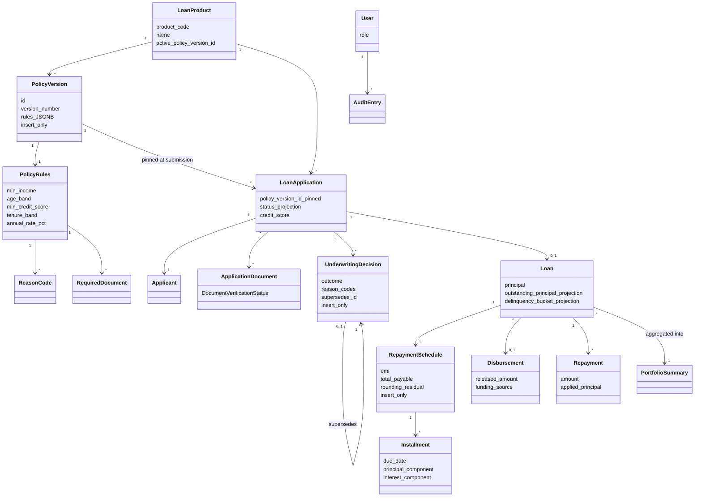

# REASONS Canvas — TrueLend

The narrative spine of this design. Authority is
`specs/decisions/design-decisions.json`; this Canvas explains and governs the
documents beside it, and decides nothing on its own. The six calls this
rendering returned as unresolved were settled as D-J through D-O;
`specs/decisions/design-unresolved.json` is now empty.

---

## Requirements

**Problem.** Horizon Bank's lending stack requires a code change to launch a loan
product or retune a threshold. TrueLend makes the product catalog and its
underwriting rules data, and carries an application from submission through
decision, disbursement, repayment and delinquency ageing — with every production
line generated by an agent under supervision.

**Definition of done.** All 29 ready stories pass their acceptance criteria in a
running Compose stack: three products bound to distinct versioned rule sets; an
admin retunes a threshold and the next decision cites the new version with no
restart; a submission is pinned, scored and decided with reason codes from its
pinned version; an approval generates a schedule whose per-installment principal
plus interest equals total payable exactly; a disbursement and a repayment move
the loan's projections; a 35-day-overdue loan reads DPD-30 after the end-of-day
run; the admin dashboard reports the portfolio without triggering that run.

**Criteria this design realizes** — all 29 stories across 17 epics
(`specs/stories/stories.json`). The milestone spine:

| Milestone | Stories | Representative criteria |
|---|---|---|
| M1 Policy & Catalog | E15-S1, E15-S2, E9-S1, E1-S1, E1-S2, E3-S1, E2-S1, E3-S2, E16-S1 | E1-S1-AC3, E1-S2-AC3, E2-S1-AC2, E3-S1-AC1, E3-S2-AC2, E15-S1-AC2, E15-S2-AC2 |
| M2 Apply & Decide | E4-S1..E4-S4, E5-S1, E5-S2, E6-S1, E6-S2, E7-S1, E8-S1, E4-S3, E17-S1 | E4-S2-AC3, E4-S4-AC3, E5-S1-AC1, E5-S2-AC2, E5-S2-AC4, E6-S1-AC3, E7-S1-AC2, E8-S1-AC4, E17-S1-AC1 |
| M3 Disburse & Repay | E9-S2, E9-S3, E10-S1, E11-S1, E11-S2, E12-S1, E13-S1, E14-S1, E15-S3 | E9-S3-AC1, E9-S3-AC3, E10-S1-AC4, E11-S1-AC1, E11-S2-AC1, E12-S1-AC2, E14-S1-AC4, E15-S3-AC1 |

Nothing is in `backlog-needs-breakdown.md`: no story was deferred.

**One criterion was amended rather than satisfied as written.** `E9-S1-AC3` and
FRD-57 originally required frontend money to be held as integer minor units,
which decision D-G rules out. **D-J** amends both to "held as a decimal value,
never a float" and leaves D-G standing, so there is one oracle instead of two.
`E9-S1`'s story bundle and `features.json` entry must be re-rendered from the
amended AC — a `/spec` re-render, not part of this document set.

---

## Entities

`specs/brownfield/code-graph.json` exists but is **empty**
(`code-graph.meta.json`: `status: "empty"`, `producer: "none"`, 0 nodes), so no
entity can cite a graph node and every entity below is **new**. Names are
CONTEXT.md terms verbatim; `data-models.schema.json` `$defs` and the OpenAPI
`components.schemas` keys are the same 38-40 names (D-H).

Business rules carried by the model rather than by prose:

- `product.active_policy_version_id` is UNIQUE, so no two Loan Products can share
  a Policy Version (`E2-S1-AC2` becomes structural).
- Activation is a pointer on the product, never an `is_active` flag on the Policy
  Version — flipping a flag would be an UPDATE the immutability scan forbids.
- `application.policy_version_id` is written once and never updated: the pin.
- An Applicant is inlined on the application row, because exactly one exists per
  application and a child table would model a cardinality `SG-7` denies.
- `disbursement.loan_id` is UNIQUE: the idempotence guard is a constraint, not
  only a service check.
- `Installment` carries no paid flag; paid/unpaid is derived, because D-E grants
  no such projection.
- `EndOfDayRun` and `PortfolioSummary` are derived, not tables. Persisting a run
  row would break the byte-identical second-run assertion.

---

## Approach

**Chosen.** Rules are data, decisions are pinned, facts are append-only and reads
are cheap. Concretely: one JSONB threshold document per Policy Version validated
by one Pydantic model and read by one threshold-driven evaluator (D-A); the
version pinned on the application at submission and read by checklist, score,
decision and override alike (D-D); insert-only fact tables with three stored
projections rather than derive-on-read (D-E); fixed-point money as a quoted
string at every hop (D-G); one `require_roles` dependency at the controller
boundary (D-F); DPD boundaries as Config constants with the residual confined to
the final installment (D-B, D-C).

**Rejected, and what decided it.**

| Alternative | Rejected because |
|---|---|
| Expression DSL for policy rules | FRD-13 names a fixed threshold set. A DSL buys rule shapes nobody asked for and adds a parser plus an injection surface (D-A). |
| Typed columns per threshold | Every new threshold becomes an ALTER TABLE, which NFR-22's append-only migration rule constrains (D-A). |
| NPA at 90 days (RBI convention) | It overlaps DPD-90 and leaves one of FR-09's five named buckets unreachable (D-B). |
| Per-product configurable ageing | Would drag the End-Of-Day Run into resolving a Policy Version per loan (D-B). |
| Spread the rounding residual across early installments | The schedule stops being recomputable from principal, rate and tenure plus one adjustment; the residual smears instead of sitting in one auditable place (D-C). |
| Store unrounded money, round at the edge | NFR-01's 2dp would describe presentation rather than stored money (D-C, D-G). |
| Pin the policy version at decision time | The FR-02 checklist and the FR-04 decision could then disagree about required documents (D-D). |
| Full event sourcing | The Portfolio Summary would replay every loan's history on each read, against NFR-26 (D-E). |
| Server-side session behind an HttpOnly cookie | Adds a session store to the Compose stack and a CSRF surface (D-F). |
| Integer minor units on the wire | Scale/unscale conversions at both edges, for no gain over a quoted decimal string (D-G). The FRD-57 / E9-S1-AC3 conflict was closed by amending the AC (D-J), so minor units are ruled out on the frontend too. |
| Pro-rata splitting of a partial repayment | Interest-before-principal within the oldest unpaid Installment is standard practice and the least surprising split to audit (D-K). |
| A MANUAL_REVIEW query alias over an UNDER_REVIEW status | The workbench filter and the two staff mockups would read differently from the schema; the enum carries the seventh state instead (D-L). |
| An 8-hour token, or a refresh token to soften a short one | A working-day theft window with no refresh path to revoke it; D-F already forecloses refresh in v1 (D-M). |
| UNDERWRITER disbursement | Approving an application and moving the money would collapse into one privilege (D-N). |
| Throttling middleware in the app factory | No requirement or NFR defines request volume, so any figure would be invented; the login attempt-throttle gap is recorded as accepted (D-O). |
| One flat service package | Every story edits the same files, which is exactly what makes the 21-story C1 cluster serialize (D-I). |

---

## Structure

Six layers, strictly one-way: Types → Config → Repository → Service → API → UI.
Five bounded contexts cut vertically through Repository, Service and API (D-I):
**Policy & Catalog** (core, high volatility — the configurability surface),
**Origination** (core, medium), **Servicing** (core, low), **Delinquency &
Portfolio** (core, medium), **Identity & Audit** (supporting, low).

Integration contracts, one per context, are the only cross-context surfaces:

| Context | Published contract |
|---|---|
| Policy & Catalog | a read-only accessor returning validated Policy Rules for a pinned version id, plus that version's Reason Code set; activation writes here and nowhere else |
| Origination | submit a submission, verify a document, evaluate or override a decision; emits an approved application |
| Servicing | disburse, read a schedule, post a repayment; publishes the Installment ladder |
| Delinquency & Portfolio | recalculate buckets for an As-Of Date, read a Portfolio Summary; consumes the published ladder, never Servicing's tables |
| Identity & Audit | require_roles at the API layer, append an Audit Entry, bind a Correlation Id |

Balanced coupling: the high-volatility Policy context is held at a distance
behind a narrow versioned accessor and nobody reads its JSONB directly; the
low-volatility Servicing-to-Delinquency pair is genuinely sequential so a
stronger integration is acceptable; Identity & Audit is generic enough to be used
directly everywhere, which is why it must stay free of domain meaning.

Layer placement detail that matters: the DelinquencyBucket enum is in Types while
`classify` and its boundaries are in Config, because Types may import nothing and
D-B puts the boundaries in Config. Both live in one file pair owned by one story,
so the mapping has exactly one owner.

Agreement check: this section matches `architecture.md`, `folder-structure.md`
and the six-layer config in `.claude/architecture.md`.

---

## Operations

Ordered, testable steps. The file each lands in feeds the Governs list.

1. **Platform first** — app factory, correlation-id middleware, redaction filter,
   error mapping, `/health`, `/metrics`, log-capture fixture:
   `backend/src/api/app.py`, `backend/src/api/middleware.py`,
   `backend/src/config/logging.py`, `backend/src/api/platform/routes.py`. Retrofit-hostile, so it precedes every other log line.
2. **Money** — `quantize_money`, `money_to_str`, `money_from_str`, the single
   Pydantic serializer, the frontend parser: `backend/src/types/money.py`,
   `backend/src/api/serializers.py`, `frontend/src/types/money.ts`.
3. **Identity** — `authenticate(username, password) -> jwt`, `current_user`,
   `require_roles(*roles)`, `audit(...)`: `backend/src/service/identity/auth.py`,
   `backend/src/api/authz.py`, `backend/src/service/identity/audit.py`.
4. **Policy store and accessor** — `PolicyVersionRepository.insert/get/get_active`
   with no update and no delete; `rules_for_version`, `reason_codes_for_version`,
   `active_policy_version`, `publish_policy_version`:
   `backend/src/repository/policy/policy_version_repository.py`,
   `backend/src/service/policy/policy_accessor.py`,
   `backend/src/service/policy/policy_publisher.py`.
5. **Intake** — `submit(submission, actor)` resolving the active version once,
   guarding minimum income, pinning `policy_version_id`, generating the checklist:
   `backend/src/service/origination/intake.py`,
   `backend/src/service/origination/checklist.py`,
   `backend/src/service/origination/income_guard.py`.
6. **Score and decide** — `score(applicant) -> int` (pure, no clock),
   `evaluate(application_id)` reading only the pinned version,
   `record_manual_decision`, `override_decision` with `supersedes_id`:
   `backend/src/service/origination/scoring.py`,
   `backend/src/service/origination/decision.py`,
   `backend/src/service/origination/override.py`.
7. **Documents** — `verify_document(...)` and `verification_queue()`:
   `backend/src/service/origination/document_verification.py`.
8. **Schedule** — `compute_schedule(terms, first_due_date)`: EMI over principal,
   periodic rate and tenure; per-period interest from the opening balance; the
   final installment's principal set to the remaining balance so the residual
   lands there: `backend/src/service/servicing/emi.py`,
   `backend/src/service/servicing/schedule.py`.
9. **Ladder** — `ladder_state(loan_id, as_of_date)`: the single derivation of
   cumulative due, cumulative paid, oldest unpaid installment and Days Past Due:
   `backend/src/service/servicing/installment_ladder.py`.
10. **Disburse and repay** — `disburse(loan_id, actor)` with an idempotence guard;
    `post_repayment(loan_id, amount, actor)` appending a posting and writing both
    projections through one path: `backend/src/service/servicing/disbursement.py`,
    `backend/src/service/servicing/repayment.py`,
    `backend/src/service/servicing/loan_projection.py`.
11. **Ageing** — `classify(days_past_due)`, `recalculate(loan_id, as_of_date)`,
    `run_end_of_day(as_of_date)`: `backend/src/config/delinquency.py`,
    `backend/src/service/delinquency/recalculation.py`,
    `backend/src/service/delinquency/end_of_day.py`.
12. **Reporting** — `portfolio_summary()` over stored bucket state only:
    `backend/src/service/delinquency/portfolio.py`.
13. **Screens** — Login and Catalog, Apply, Track, Repay, Workbench and Decision
    Review, Admin console, Policy Editor, Portfolio:
    `frontend/src/ui/pages/`, `frontend/src/ui/components/`, `frontend/src/api/`.
14. **Harnesses** — invariant registry, layer test, immutability scans, migration
    lint, route-authorization coverage, SLO load run, axe-core and keyboard
    traversal: `backend/tests/architecture/`, `backend/tests/slo/`,
    `frontend/tests/a11y/`.

Per-story file ownership is in `component-map.md`.

---

## Norms

- **Static typing everywhere.** Full annotations in Python, mypy over `src/`; zero
  `any` in TypeScript — `unknown` plus narrowing.
- **TDD.** Test first, then implementation. Architecture invariants are tests in
  `backend/tests/architecture/`, registered so an unregistered invariant fails the
  suite.
- **Size limits.** Functions at most 30 lines, files at most 300 — enforced by the
  pre-write gate. The context split in D-I is what keeps modules under it.
- **Naming.** Domain vocabulary from CONTEXT.md, verbatim, in schemas, types and
  code. A new concept goes into CONTEXT.md first (D-H). No DTO suffixes.
- **Layering.** Imports flow one way only; a Service never imports from API, a
  Repository never from Service. Cross-context access goes through the target
  context's service, never its repository.
- **No pass-through modules.** Where a story has no business rule the router uses
  the repository contract directly.
- **Dependency injection.** FastAPI `Depends` for the session, the current user
  and repositories; no module-level singletons holding state.
- **Logging — SG-9.** Structured JSON only, one Correlation Id per request on
  every line, and the redaction filter installed on every configured logger.
  Applicant PAN, Aadhaar and salary-document content never reach a sink.
- **Errors.** Typed error classes in Types, raised in Service, mapped exactly once
  at the API boundary. Nothing is swallowed; no bare `except`.
- **Money.** `Decimal` in Python, `NUMERIC(14,2)` in Postgres, a quoted 2dp string
  on the wire, a decimal library in TypeScript. No float in a money code path.
- **Commits.** Conventional format, branch `<type>/<description>`, agent
  co-authorship on every production commit.

---

## Safeguards

Non-negotiable boundaries. A reviewer checks the diff against these.

**Business prohibitions from `specs/brd/brd-safeguards.json`** — all ten are
`forbidden_action`, so all ten are filed here:

- **SG-1** — no late fee, penal interest, collections workflow or write-off. No
  monetary field anywhere on the delinquency path: `classify` returns a bucket and
  nothing else, and no schema in this design has a fee, penalty or charge
  property.
- **SG-2** — no real money movement and no credit-bureau call. `funding_source.py`
  is a stub returning a configured identifier; `scoring.py` has no outbound
  collaborator and no credential; the Compose stack configures no provider
  endpoint.
- **SG-3** — no native or responsive mobile client. Desktop-and-tablet web only.
- **SG-4** — no customer notification of any kind. No email, SMS or notification
  module, and the Track screen shows state without dispatching anything.
- **SG-5** — no electronic signature and no signed loan-agreement artifact. The
  disbursement writes a row and produces no document.
- **SG-6** — single currency. No currency field and no exchange-rate path.
- **SG-7** — one Applicant per Loan Application. Enforced structurally: the
  applicant is inlined on the application row, so no second applicant can exist.
- **SG-8** — no top-up, restructuring or mid-life modification of a disbursed
  loan. No endpoint mutates loan principal, rate or tenure after disbursement.
- **SG-9** — no KYC or AML verification against an external registry. PAN and
  Aadhaar are captured as application data, never verified, and redacted from
  every log line.
- **SG-10** — no early settlement, foreclosure or prepayment quote. The loan view
  offers posting a repayment and nothing else.

**Design invariants.**

- A Policy Version is never mutated: the repository exposes no update or delete,
  and an architecture test reports 0 UPDATE, 0 DELETE and 0 ORM mutations against
  `policy_version` across `src/` and `migrations/`.
- A Repayment Schedule and its Installments are never mutated after generation;
  the same scan covers `schedule_installment`.
- An Underwriting Decision is never edited; an Override appends with
  `supersedes_id` set.
- A decision cites only Reason Codes declared by the Policy Version pinned to its
  application.
- An application's `policy_version_id` is written at submission and never
  retargeted by a later activation.
- Money is fixed-point 2dp end to end; no float touches a monetary value.
- Per-Installment principal plus interest equals Total Payable **exactly** — no
  epsilon, no tolerance. The residual sits in the final Installment.
- An End-Of-Day Run is idempotent for a given As-Of Date.
- Every non-public route carries `require_roles`; the generated suite asserts 100%
  coverage of the 401 and 403 cases, so a new unguarded route fails the build.
- Every underwriter and admin action appends exactly one Audit Entry.

**Limits and budgets.**

- Runtime SLO: p95 under 500 ms and error rate under 1% on the four registered
  read-heavy endpoints (`GET /products`, `GET /applications`, `GET /loans/{id}`,
  `GET /dashboard`).
- `GET /health` returns 200 within 1 second of a successful startup.
- WCAG 2.1 AA with zero axe violations and no suppressed rule on Apply, Track and
  Repay.
- Functions at most 30 lines, files at most 300.
- **Token lifetime is 3600 seconds** (`Settings.jwt_ttl_seconds`), per **D-M** —
  the whole session length, since D-F issues no refresh token.
- **No rate limit, quota or throttle anywhere**, per **D-O**: v1 ships no
  throttling middleware, so no test asserts one and `POST /auth/login` has no
  attempt throttle. Combined with the absent lockout policy that is an accepted
  credential-stuffing gap, not an oversight.
- **No backup retention window is asserted here.** None is recorded in the
  decisions file, and a number nobody chose reads as decided once written down.

**Coupling-risk safeguards** (from the Step 0.7 assessment):

- one money serializer module; one DPD boundary mapping; one EMI and residual
  implementation; one paid/unpaid derivation; one projection write path.
- projection drift is caught by replay reconciliation against `disbursement` and
  `repayment_posting`.
- `(principal, rate, tenure)` and `(as_of_date, loan_id, bucket)` are value
  objects in Types before the clump spreads.

---

## Governs

Source paths this design creates or modifies.

- `backend/src/types/money.py`
- `backend/src/types/loan_terms.py`
- `backend/src/types/enums.py`
- `backend/src/types/policy.py`
- `backend/src/types/policy_violation.py`
- `backend/src/types/origination.py`
- `backend/src/types/servicing.py`
- `backend/src/types/delinquency.py`
- `backend/src/types/identity.py`
- `backend/src/types/errors.py`
- `backend/src/config/settings.py`
- `backend/src/config/logging.py`
- `backend/src/config/delinquency.py`
- `backend/src/repository/models.py`
- `backend/src/repository/policy/product_repository.py`
- `backend/src/repository/policy/policy_version_repository.py`
- `backend/src/repository/origination/application_repository.py`
- `backend/src/repository/origination/checklist_repository.py`
- `backend/src/repository/origination/decision_repository.py`
- `backend/src/repository/servicing/loan_repository.py`
- `backend/src/repository/servicing/schedule_repository.py`
- `backend/src/repository/servicing/disbursement_repository.py`
- `backend/src/repository/servicing/repayment_repository.py`
- `backend/src/repository/delinquency/portfolio_repository.py`
- `backend/src/repository/identity/user_repository.py`
- `backend/src/repository/identity/audit_repository.py`
- `backend/src/service/policy/catalog.py`
- `backend/src/service/policy/policy_accessor.py`
- `backend/src/service/policy/policy_publisher.py`
- `backend/src/service/origination/intake.py`
- `backend/src/service/origination/checklist.py`
- `backend/src/service/origination/income_guard.py`
- `backend/src/service/origination/scoring.py`
- `backend/src/service/origination/decision.py`
- `backend/src/service/origination/override.py`
- `backend/src/service/origination/document_verification.py`
- `backend/src/service/servicing/emi.py`
- `backend/src/service/servicing/schedule.py`
- `backend/src/service/servicing/installment_ladder.py`
- `backend/src/service/servicing/loan_projection.py`
- `backend/src/service/servicing/disbursement.py`
- `backend/src/service/servicing/funding_source.py`
- `backend/src/service/servicing/repayment.py`
- `backend/src/service/delinquency/recalculation.py`
- `backend/src/service/delinquency/end_of_day.py`
- `backend/src/service/delinquency/portfolio.py`
- `backend/src/service/identity/auth.py`
- `backend/src/service/identity/audit.py`
- `backend/src/api/app.py`
- `backend/src/api/deps.py`
- `backend/src/api/authz.py`
- `backend/src/api/middleware.py`
- `backend/src/api/errors.py`
- `backend/src/api/serializers.py`
- `backend/src/api/platform/routes.py`
- `backend/src/api/identity/routes.py`
- `backend/src/api/identity/audit_routes.py`
- `backend/src/api/policy/routes.py`
- `backend/src/api/policy/policy_version_routes.py`
- `backend/src/api/origination/routes.py`
- `backend/src/api/origination/document_routes.py`
- `backend/src/api/origination/override_routes.py`
- `backend/src/api/servicing/routes.py`
- `backend/src/api/delinquency/end_of_day_routes.py`
- `backend/src/api/delinquency/portfolio_routes.py`
- `backend/migrations/versions/*.py`
- `backend/tests/conftest.py`
- `backend/tests/architecture/*.py`
- `backend/tests/slo/*.py`
- `backend/tests/unit/*.py`
- `backend/tests/integration/*.py`
- `frontend/src/types/money.ts`
- `frontend/src/types/api.ts`
- `frontend/src/types/enums.ts`
- `frontend/src/config/env.ts`
- `frontend/src/config/roles.ts`
- `frontend/src/api/client.ts`
- `frontend/src/api/auth.ts`
- `frontend/src/api/products.ts`
- `frontend/src/api/policy.ts`
- `frontend/src/api/applications.ts`
- `frontend/src/api/workbench.ts`
- `frontend/src/api/admin.ts`
- `frontend/src/api/loans.ts`
- `frontend/src/api/dashboard.ts`
- `frontend/src/ui/App.tsx`
- `frontend/src/ui/routes.tsx`
- `frontend/src/ui/pages/Login.tsx`
- `frontend/src/ui/pages/Catalog.tsx`
- `frontend/src/ui/pages/PolicyEditor.tsx`
- `frontend/src/ui/pages/Apply.tsx`
- `frontend/src/ui/pages/Track.tsx`
- `frontend/src/ui/pages/Repay.tsx`
- `frontend/src/ui/pages/Workbench.tsx`
- `frontend/src/ui/pages/DecisionReview.tsx`
- `frontend/src/ui/pages/AdminApplications.tsx`
- `frontend/src/ui/pages/Portfolio.tsx`
- `frontend/src/ui/components/MoneyText.tsx`
- `frontend/src/ui/components/BucketBadge.tsx`
- `frontend/src/ui/components/ReasonCodeList.tsx`
- `frontend/src/ui/components/StatusPill.tsx`
- `frontend/src/ui/components/ChecklistList.tsx`
- `frontend/tests/a11y/*.ts`
- `frontend/tests/unit/*.tsx`
- `docker-compose.yml`
- `Dockerfile.backend`
- `Dockerfile.frontend`
- `init.sh`
- `project-manifest.json`
